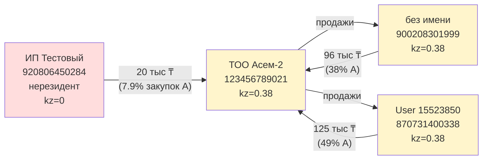

# Конусы и аналитика

После расчёта `kz_content` для всех узлов движок предоставляет **четыре
аналитических представления**:

1. **Профиль компании (карточка)** — сводка по одному BIN.
2. **Backward-конус** — откуда поступает товар.
3. **Forward-конус** — куда уходит товар.
4. **Агрегаты по экономике** — глобальные метрики.

## Профиль компании { #target-card }

Карточка показывает базовые метрики по выбранной компании (пример вывода ниже).

```text
Компания:    ТОО "Асем-2"
BIN:         123456789021
Роль:        посредник
Закупки:     253 тыс ₸            (4 поставщиков)
Продажи:     12.00 млн ₸          (8 покупателей)
▶ ИНДЕКС КС: 37.68%  (kz = 0.3768)
▶ Импортная составляющая в продажах: 7.48 млн ₸
```

«Роль» вычисляется по in-/out-degree:

| Условие | Роль |
|---|---|
| `is_non_resident == True` | нерезидент-импортёр |
| `in_degree == 0` | источник (нет поставщиков в графе) |
| `out_degree == 0` | конечный потребитель |
| иначе | посредник |

«Импортная составляющая в продажах» = $\mathrm{sales}(v) \cdot (1 - \mathrm{kz}(v))$.
Это **наиболее интуитивная метрика для бизнес-аудитории**: «сколько тенге
импорта эта компания продала за период».

## Backward-конус { #backward-cone }

**Backward-конус** — обход графа **вверх** от заданного BIN, отвечает
на вопрос: «откуда у этой компании приходит товар, и сколько из этого
импорт?».

### Что считается

#### 1. Прямые поставщики (топ-10 по сумме закупки)

Для каждого поставщика $u \to v$:

| Метрика | Формула |
|---|---|
| Сумма | $w(u, v)$ |
| Доля | $w(u, v) / \sum_u w(u, v)$ — какую долю в закупках $v$ занимает $u$ |
| `kz` | $\mathrm{kz}(u)$ |
| Признак | «нерезидент», если $r(u) = 0$ |

#### 2. Прямой импорт

Сумма закупок от нерезидентов:

$$
\mathrm{import}_{\text{direct}}(v) = \sum_{u : r(u) = 0} w(u, v)
$$

Если её нет, но среди поставщиков есть «зашумлённые» (с $\mathrm{kz}(u) < 0.7$),
движок выводит предупреждение «импорт приходит через посредников».

#### 3. BFS по слоям

Обратный BFS на $G^{-1}$ начиная с target:

```python
R = G.reverse(copy=False)
visited = {target}
layer = {target}
for L in range(1, max_layers + 1):
    next_layer = set()
    for v in layer:
        for u in R.successors(v):
            if u not in visited:
                next_layer.add(u)
                visited.add(u)
    if not next_layer:
        break
    layer = next_layer
```

Для каждого слоя выводится:

- размер слоя в узлах,
- средний `kz` по слою,
- количество нерезидентов в слое.

```text
Слой 1:     4 компаний  avg kz=0.438  нерезидентов: 1
Слой 2: пусто (цепочка закончилась)
Всего в backward-конусе: 5 компаний (0.00% графа)
```

### Когда backward-конус неинформативен

- Узел — нерезидент: у него по определению нет поставщиков в графе.
- Узел — источник по другим причинам (физлицо, импорт без ЭСФ).
- Узел в обоих случаях движок печатает короткое пояснение и пропускает BFS.

## Forward-конус { #forward-cone }

**Forward-конус** — обход графа **вниз**, отвечает на вопрос:
«куда расходится продукция этой компании?».

Особенно ценен для **нерезидентов**: показывает, как далеко проникает
импортный товар по экономике.

### Что считается

#### 1. Прямые покупатели (топ-10 по объёму)

Для каждого покупателя $v \to c$:

| Метрика | Формула |
|---|---|
| Закупил | $w(v, c)$ |
| Доля | $w(v, c) / \sum_u w(u, c)$ — **какую долю в закупках покупателя занимает наш товар** |
| `kz` | $\mathrm{kz}(c)$ |

«Доля» — самая интересная колонка: если она 100%, значит покупатель
**полностью зависит** от нашего нерезидента и других поставщиков у него
в этом периоде нет.

#### 2. BFS по слоям

Прямой BFS на $G$:

```python
visited = {target}
layer = {target}
for L in range(1, max_layers + 1):
    next_layer = set()
    for v in layer:
        for u in G.successors(v):
            if u not in visited:
                next_layer.add(u)
                visited.add(u)
    if not next_layer:
        break
    layer = next_layer
```

Для каждого слоя выводятся:

- размер слоя,
- сумма продаж компаний слоя другим компаниям (если 0 — товар
  «остановился», ушёл к конечным потребителям),
- средний `kz` по слою,
- количество **конечных потребителей** в слое (нет исходящих рёбер).

```text
Слой 1:    91 компаний  их продажи всего: 0 ₸  avg kz=0.030 (из них конечных потребителей: 91)
```

В этом примере (нерезидент `180640000680`) мы наглядно видим, что
**весь импортный товар уходит сразу к конечным потребителям** —
не перепродаётся дальше по цепочке.

## Агрегаты по экономике { #aggregate }

**Агрегаты по экономике** печатают глобальные метрики:

| Метрика | Формула |
|---|---|
| Совокупный оборот | $\sum_{v \in V_{\text{seller}}} \mathrm{sales}(v)$ |
| Импортная составляющая | $\sum_{v \in V_{\text{seller}}} \mathrm{sales}(v) \cdot (1 - \mathrm{kz}(v))$ |
| Казахстанская составляющая | $\sum_{v \in V_{\text{seller}}} \mathrm{sales}(v) \cdot \mathrm{kz}(v)$ |
| Доля импорта в обороте | (импорт / оборот) × 100% |

Где $V_{\text{seller}}$ — узлы с $\deg^{+}(v) > 0$ (хотя бы одно
исходящее ребро).

```text
Совокупный оборот:        22.14 млрд ₸
Импортная составляющая:   22.23 млн ₸  (0.10%)
Казахстанская составляющая: 22.12 млрд ₸  (99.90%)
```

!!! note "Только видимая часть экономики"
    Это **не** доля импорта в ВВП Казахстана. Это доля импорта **в B2B-обороте,
    задокументированном через ЭСФ за период**. Здесь не учтены:
    розница, экспорт услуг, внешнеторговые операции через таможню без ЭСФ,
    госзакупки.

## Меню кандидатов для демо { #list-cases }

**Меню типовых кейсов** сканирует граф и предлагает по нескольку кандидатов в каждой из
четырёх категорий — это быстрый способ найти **архетипические BIN'ы** для
демонстрации.

### Архетип 1: Импортёры

Нерезиденты с реальными продажами в этом периоде.

```text
[1] ИМПОРТЁРЫ — нерезиденты с реальными продажами:
   180640000680  Company 85645214      14.48 млн ₸  91 покупателей
   920806450284  ИП Тестовый              33 тыс ₸  6 покупателей
```

### Архетип 2: Зависимые

Резиденты с `kz < 0.7` и продажами больше 10 млн ₸. Идеальный кейс для
демонстрации, как импорт «протекает» через формально казахстанских посредников.

```text
[2] ЗАВИСИМЫЕ ОТ ИМПОРТА:
   123456789021  ТОО "Асем-2"           12.00 млн ₸  kz= 0.38
```

### Архетип 3: Чистые крупные

Резиденты с `kz ≈ 1.0` и продажами больше 100 млн ₸ — здоровое звено
экономики.

```text
[3] ЧИСТЫЕ КРУПНЫЕ:
   240140001872  Company 45862          11.85 млрд ₸  kz= 1.00
   71040003425   Company 1327612         4.07 млрд ₸  kz= 1.00
```

### Архетип 4: В нетривиальных циклах

Узлы из SCC размера ≥ 2 — они образуют замкнутую торговую группу.

```text
[4] В НЕТРИВИАЛЬНЫХ ЦИКЛАХ (SCC > 1):
    Цикл #5 (размер 3):
       123456789021  ТОО "Асем-2"        kz=0.38  продажи: 12.00 млн ₸
       870731400338  User 15523850       kz=0.38  продажи: 183 тыс ₸
       900208301999  (без имени)         kz=0.38  продажи: 201 тыс ₸
```

Этот цикл — **золотой пример обработки циклов**: три компании, замкнутый
треугольник, и все три имеют один и тот же индекс 0.38, потому что
импорт от ИП Тестовый (нерезидент) «зарядил» весь цикл через одно ребро.

## SCC: пример анализа { #scc-example }



Любой узел из этого SCC, переданный в `--targets`, выдаст одинаковый
индекс. Это математически корректно — алгоритм не видит «направления вины»
внутри цикла.
