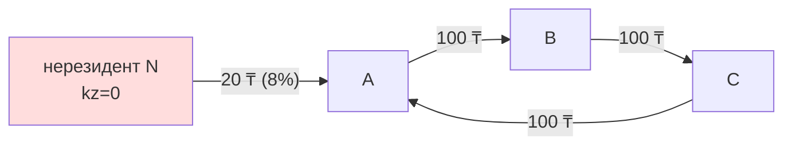

# Расчёт индекса КС

## Постановка задачи

Дано:

- Взвешенный направленный граф $G = (V, E, w)$ сделок B2B за период (см. [общий обзор](index.md));
- Атрибут резидентности $r(v) \in \{0, 1, \bot\}$ для каждого узла.

Найти: $\mathrm{kz}: V \to [0, 1]$, такое что:

$$
\mathrm{kz}(v) = \begin{cases}
0 & r(v) = 0 \\
1 & r(v) \neq 0 \text{ и } \deg^{-}(v) = 0 \\
\dfrac{\sum_{u \to v} w(u,v) \cdot \mathrm{kz}(u)}{\sum_{u \to v} w(u,v)} & \text{иначе}
\end{cases}
$$

## Алгоритм fixed-point итераций

### Инициализация

Разделяем узлы на **фиксированные** (значение задано) и **свободные**
(значение пересчитывается).

| Категория узла | Фиксирован? | Начальное `kz` |
|---|---|---|
| Нерезидент по VoltDB ($r(v) = 0$) | да | 0.0 |
| Резидент-источник (входящих рёбер нет) | да | 1.0 |
| Источник без записи в VoltDB | да | 1.0 (оптимистичное допущение) |
| Все остальные | **нет** | 1.0 (стартовая точка для итераций) |

Псевдокод:

```python
fixed = set()
kz = {}

for v in G.nodes:
    is_nr = G.nodes[v].get("is_non_resident")
    if is_nr is True:
        kz[v] = 0.0
        fixed.add(v)
    elif G.in_degree(v) == 0:
        kz[v] = 1.0
        fixed.add(v)
    else:
        kz[v] = 1.0  # стартовое значение
```

### Итерации

На каждой итерации мы **только пересчитываем свободные узлы**;
фиксированные значения остаются нетронутыми.

```python
in_edges = {v: list(G.in_edges(v, data="weight"))
            for v in G.nodes if v not in fixed}

for it in range(1, max_iter + 1):
    delta_max = 0.0
    new_kz = kz.copy()
    for v, ies in in_edges.items():
        total_w = 0.0
        acc = 0.0
        for u, _, w in ies:
            if w is None or w <= 0:
                continue
            total_w += w
            acc += w * kz[u]
        if total_w > 0:
            val = acc / total_w
            d = abs(val - kz[v])
            delta_max = max(delta_max, d)
            new_kz[v] = val
    kz = new_kz
    if delta_max < tol:
        break
```

### Параметры

| Параметр | Значение | Обоснование |
|---|---|---|
| `max_iter` | 500 | На реальных данных сходится за 200–250 итераций. 500 — двойной запас. |
| `tol` | $10^{-7}$ | Точности 5 знаков после запятой более чем достаточно для бизнес-выводов. |

## Сходимость { #convergence }

### Интуитивное объяснение

На каждой итерации значение $\mathrm{kz}(v)$ — это **среднее взвешенное**
значений соседей сверху. Среднее не может быть больше максимума и меньше
минимума соседей. Значит, последовательность приближений «зажата» между
0 и 1, и каждая компонента не выходит за интервал.

Поскольку нерезиденты «зажаты» на 0, а резиденты-источники — на 1,
итерации **не могут разогнаться** в произвольную сторону.

### Формальный аргумент

Запишем систему как $\mathbf{x} = T \mathbf{x} + \mathbf{b}$, где:

- $\mathbf{x}$ — вектор kz свободных узлов;
- $T$ — нормированная транспонированная матрица смежности (по столбцам сумма ≤ 1);
- $\mathbf{b}$ — «впрыск» из фиксированных узлов.

Если граф без циклов между свободными узлами, спектральный радиус $\rho(T) < 1$
тривиально. Если есть циклы, но из каждого цикла есть путь в фиксированный
узел (а это **всегда** так — каждый цикл рано или поздно «съедает» долю
из источников), то $\rho(T) < 1$ всё равно выполняется.

Сжимающее отображение → **сходимость гарантирована** по теореме Банаха.

### Скорость сходимости

| Структура графа | Кол-во итераций до $10^{-7}$ |
|---|---|
| DAG (без циклов) | 1 раз глубина графа |
| Граф с короткими циклами (SCC ≤ 5) | ~50–100 |
| Граф с большим SCC | ~200–300 |

На реальной выборке **244 итерации**.

## Обработка циклов { #cycles-example }

### Пример: треугольник заражённости

Допустим есть три узла $A, B, C$, торгующих по кругу:
$A \to B \to C \to A$, и один из них (скажем, $A$) дополнительно
закупает у нерезидента $N$ небольшую долю.



Без цикла $A$ имел бы 8% импорта, $B$ и $C$ — наследовали бы по цепочке.
Из-за цикла все три узла сходятся к **одному и тому же** значению —
**средневзвешенному** из импорта и резидентских поставок:

$$\mathrm{kz}(A) = \mathrm{kz}(B) = \mathrm{kz}(C) \approx 0.92$$

Этот же эффект мы видим на реальных данных в кейсе **ТОО «Асем-2»** —
все три участника цикла имеют `kz = 0.38`.

Это **не баг, а свойство**: в экономически сцепленной группе нет смысла
разделять «чьи деньги в чём» — они все в одной лодке.

## Численная стабильность

Несколько практических защит:

| Проблема | Защита |
|---|---|
| Деление на ноль (узел без значимых рёбер) | `if total_w > 0:` перед делением |
| Отрицательные веса (возвраты) | `if w is None or w <= 0: continue` внутри цикла |
| Узел без атрибута `is_non_resident` | Считается резидентом (оптимистично) |
| Резкое колебание на границе цикла | Стандартный fixed-point с относительным сдвигом |

## Производительность

На 100K узлов / 106K рёбер:

| Этап | Время |
|---|---|
| Загрузка из MySQL | ~5 с |
| Построение графа | ~1 с |
| VoltDB lookup (chunks по 1000) | ~25 с |
| 244 итерации fixed-point | ~50 с |
| **Итого** | **~80 с** |

Где это ускорять:

- :material-arrow-right: переписать ядро итераций на `scipy.sparse` matvec —
  ожидаемо ×10 ускорение, но усложнит интеграцию с `nx.DiGraph`.
- :material-arrow-right: распараллелить VoltDB chunks (сейчас последовательно).
- :material-arrow-right: для production — закэшировать VoltDB-снимок в
  parquet и обновлять раз в сутки.

См. [Roadmap](../roadmap.md).
