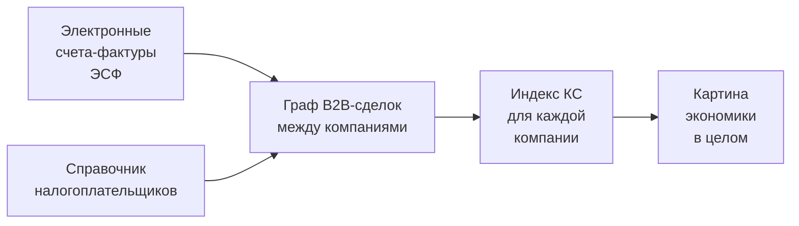

# О проекте простыми словами

> Эта страница — для тех, кто принимает решения и формирует политику.
> Без формул, кода и технических подробностей.

## Зачем мы это делаем

Сегодня **«казахстанское содержание»** (КС) в товарах и услугах для
большинства закупок и контрактов считается **по самодекларации**: компания
сама заявляет, какая часть её продукции произведена в Казахстане. Проверка
обычно ограничивается формальностями — наличие договора, номер БИН поставщика.

Если казахстанская компания закупает импортный товар у иностранного
поставщика, а потом перепродаёт его другой казахстанской компании уже
с пометкой «казахстанское» — этот факт сегодня **никем не отслеживается**.

Государство не видит:

- сколько тенге, заявленных как «казахстанское», на самом деле — импорт;
- какие отрасли наиболее зависимы от импортных цепочек;
- где именно «скрытый» импорт скапливается в посредниках.

## Что мы предлагаем

Мы используем электронные счета-фактуры (ЭСФ), которые **уже сегодня**
обязательны для всех B2B-сделок в Казахстане, и из них строим граф —
кто кому продал, на какую сумму, какой продукт. Каждая компания в графе —
точка, каждая сделка — стрелка между точками.

К графу мы подключаем **государственный справочник налогоплательщиков**,
из которого узнаём, кто резидент, а кто нерезидент.

Дальше алгоритм автоматически **прослеживает цепочки поставок**:
если в любом звене цепочки появляется нерезидент — алгоритм считает,
что эта доля стоимости пришла из импорта, и распространяет «отметку
импорта» вниз по графу — к покупателям, к покупателям покупателей,
и так далее.

## Что показывает индекс компании

У каждой компании в системе появляется одно понятное число — индекс КС
от 0% до 100%:

| Индекс | Что это значит |
|---|---|
| **100%** | Вся продукция компании произведена в Казахстане. Все её поставщики — тоже казахстанские, и так до самого начала цепочки. |
| **80%** | Большая часть казахстанская, но в цепочке поставщиков есть импорт — он размазан по всему обороту. |
| **40%** | Около 40% стоимости — это казахстанский труд и материалы. Остальные 60% — импорт, попавший через цепочку поставщиков. |
| **0%** | Это либо нерезидент, либо вся цепочка ведёт к нерезиденту. |

**Важно:** индекс считается не «по словам компании», а **по фактическим
ЭСФ-документам**. Если компания утверждает «у нас 80% казахстанского»,
но её ЭСФ-цепочки показывают 40%, — это уже сигнал к проверке.

## Что показывает общая цифра по экономике

Когда мы суммируем продажи всех компаний за период и взвешиваем их
индексы по объёму продаж, получается **общая доля импорта в B2B-обороте**
за этот период.

Например, если общий B2B-оборот за квартал — 100 миллиардов тенге, а
импортная составляющая — 30 миллиардов, значит **30% B2B-оборота —
это переупакованный импорт**, даже если каждая отдельная сделка
формально оформлена между казахстанскими компаниями.

## Что важно понимать про эту цифру

!!! tip "Это видимая часть экономики"
    Наш индекс — это доля импорта **в B2B-обороте, задокументированном
    через ЭСФ**, за выбранный период.

    Это **не** «доля импорта в ВВП Казахстана» — это разные вещи.

В индексе **учитывается**:

- :material-check: B2B-сделки между юрлицами и ИП через ЭСФ,
- :material-check: цепочки любой длины — алгоритм проследит их до конца,
- :material-check: «эхо» от нерезидентов через несколько посредников,
- :material-check: круговые сделки между группами компаний.

В индексе **не учитывается**:

- :material-close: розничная торговля (B2C, физлица-покупатели),
- :material-close: прямой импорт через таможню без выписки ЭСФ,
- :material-close: услуги, оплачиваемые через зарубежные платёжные системы,
- :material-close: государственные субсидии и трансферы.

## Какие три картинки получает аналитик

Для любой компании система показывает:

### 1. Карточка компании

> ТОО «Х», БИН 123…, посредник.
>
> Закупки за период: 50 млн ₸, продажи: 80 млн ₸.
>
> **Индекс КС: 38%.** Импортная составляющая в продажах: 49,6 млн ₸.

### 2. Откуда поступает товар (цепочка вверх)

> Прямых поставщиков: 4. Из них 1 нерезидент с долей 7,9% закупок.
>
> Слой 1: 4 компании, средний КС: 0,44.
> Слой 2: цепочка закончилась.

### 3. Куда уходит товар (цепочка вниз)

> Прямых покупателей: 8.
>
> Слой 1: 8 компаний, продажи 200 тыс ₸, средний КС 0,41.
> Слой 2: 2 компании, средний КС 0,54.

Эти три блока вместе показывают **полную картину**: сколько импорта
вошло в компанию и куда дальше его понесли её покупатели.

## Чем это полезно

Для **государства**:

- увидеть **реальную картину** зависимости экономики от импорта,
  не доверяя самодекларациям;
- найти **«серые зоны»** — отрасли и группы компаний с большим разрывом
  между формальным и фактическим КС;
- **измерять эффект мер** по импортозамещению — динамика индекса по годам
  и отраслям покажет, работают ли стимулы;
- проверять заявленный КС в **закупках с государственным участием**.

Для **бизнеса**:

- видеть, насколько на их КС влияют **их поставщики**, а не только они сами;
- получать ранние сигналы о **зависимости от одного источника импорта**;
- более прозрачно конкурировать в тендерах, где КС — критерий.

## Как мы проверяем, что цифры правильные

Алгоритм проходит **математическую проверку на сходимость**: каждый
запуск делает 200–300 итераций уточнений, пока изменения индекса
не станут незначимыми (меньше 0,001%).

Каждая компания получает индекс **независимо от того, в каком порядке
её посчитали**. На одних и тех же входных данных результат всегда
одинаковый — это критерий научной воспроизводимости.

Алгоритм также корректно обрабатывает **круговые сделки** (когда
компании в группе торгуют друг с другом по кругу): все участники
такого цикла получают одинаковый индекс — это математически справедливо,
потому что «отделить вклад» отдельного участника в цикле невозможно.

## Текущее состояние

| Аспект | Статус |
|---|---|
| Алгоритм | :material-check: Реализован и протестирован |
| Подключение к ЭСФ (тест) | :material-check: Работает |
| Подключение к справочнику нерезидентов | :material-check: Работает |
| Web-интерфейс для аналитика | :material-check: Базовая версия готова |
| Документация | :material-check: Полная |
| Доступ к production-ЭСФ | :material-progress-clock: Требуется решение |
| Нагрузочное тестирование на годовом срезе | :material-progress-clock: Запланировано |
| Регуляторная интеграция | :material-progress-clock: Требует решения |

## Что мы предлагаем дальше

1. **Пилот на production-ЭСФ.** Один квартал реальных данных, чтобы
   получить актуальную цифру по экономике РК.
2. **Подключение классификатора ТРУ.** Это даст разрезы по отраслям —
   «КС в продуктах питания», «КС в металлопрокате», «КС в IT».
3. **Веб-портал для аналитики.** Сегодня есть минимальный интерфейс —
   эскизы для полноценного портала готовятся.
4. **Регламент применения.** Согласовать с регуляторами сценарии
   использования: проверка КС в госзакупках, отчёты по отраслям,
   индикаторы для оценки мер импортозамещения.

## Контакты и разработчик решения

Платформу `digital-echo-core` разработала компания **ТОО «Open Systems
Development»** в рамках инициативы по цифровизации оценки казахстанского
содержания.

Демонстрация и расчёт по конкретным компаниям доступны через
web-интерфейс. По вопросам пилота на production-данных — связывайтесь с
командой проекта.

!!! warning "Статус прототипа"
    Все цифры в текущей версии получены на **тестовой среде** ЭСФ
    с искусственно сгенерированными данными. Они показывают, что
    алгоритм работает, но **не отражают реальную экономику**.
    Для production-выводов нужен пилот на боевых данных.
