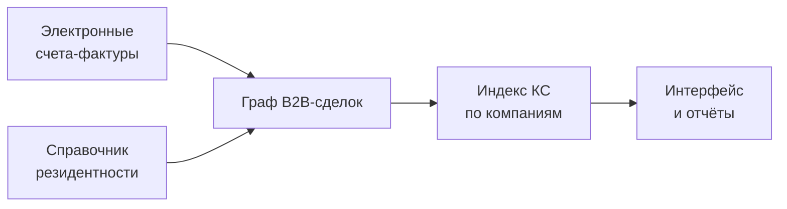

# digital-echo-core

> Аналитический движок для расчёта **индекса казахстанского содержания (КС)**
> на основе графа B2B-транзакций электронных счетов-фактур (ЭСФ).
>
> Разработка решения — **ТОО «Open Systems Development»**.

---

## Зачем этот проект

«Казахстанское содержание» — это доля стоимости товара или услуги, которая
произведена внутри Казахстана. Сейчас этот показатель рассчитывается **формально**,
по самодекларации компаний. Если компания закупает импорт у формально
казахстанского посредника — этот импорт **не виден** в отчётности.

`digital-echo-core` решает эту проблему: он строит **граф всех B2B-транзакций**
по данным ЭСФ и по **официальному справочнику резидентности** вычисляет, какая доля
продукции каждой компании реально казахстанская, а какая — переупакованный
импорт.

!!! tip "Главная аналитическая возможность"
    На любую компанию-посредника движок возвращает:

    - **kz-индекс**: число от 0 (всё импорт) до 1 (всё казахстанское),
    - **backward-конус**: откуда у неё импорт (сколько шагов и кто прямой источник),
    - **forward-конус**: куда расходится её товар (для нерезидентов — куда «оседает» импорт),
    - **импортная составляющая в продажах**: в тенге.

## Смысловая схема

## Где что искать в документации

-   :material-human: **[О проекте простыми словами](executive-summary.md)**

    Для руководства и политики — без формул и технических деталей.

-   :material-graph-outline: **[Алгоритм](algorithm/index.md)**

    Модель индекса КС, итерации, циклы, конусы поставок и сбыта.

-   :material-database-outline: **[Источники данных](data-sources/overview.md)**

    Какие данные используются и типовые масштабы выборки.

-   :material-alert-circle-outline: **[Ограничения](limitations.md)**

    Что движок пока не учитывает и какие допущения заложены.

-   :material-map-marker-path: **[Roadmap](roadmap.md)**

    Направления развития продукта.

!!! warning "Статус проекта"
    Прототип. Не использовать для production-решений или регуляторных отчётов
    без дополнительной валидации. См. [Ограничения](limitations.md).
