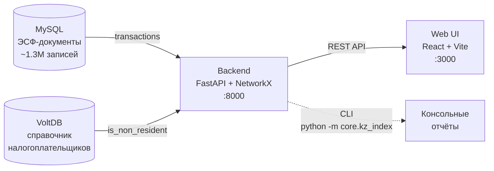

# digital-echo-core

> Аналитический движок для расчёта **индекса казахстанского содержания (КС)**
> на основе графа B2B-транзакций электронных счетов-фактур (ЭСФ).
>
> Разработка решения — **ТОО «Open Systems Development»**.

---

## Зачем этот проект

«Казахстанское содержание» — это доля стоимости товара или услуги, которая
произведена внутри Казахстана. Сейчас этот показатель рассчитывается **формально**,
по самодекларации компаний. Если компания закупает импорт у формально
казахстанского посредника — этот импорт **не виден** в отчётности.

`digital-echo-core` решает эту проблему: он строит **граф всех B2B-транзакций**
по данным ЭСФ и через справочник резидентности из VoltDB вычисляет, какая доля
продукции каждой компании реально казахстанская, а какая — переупакованный
импорт.

!!! tip "Главная аналитическая возможность"
    На любую компанию-посредника движок возвращает:

    - **kz-индекс**: число от 0 (всё импорт) до 1 (всё казахстанское),
    - **backward-конус**: откуда у неё импорт (сколько шагов и кто прямой источник),
    - **forward-конус**: куда расходится её товар (для нерезидентов — куда «оседает» импорт),
    - **импортная составляющая в продажах**: в тенге.

## Архитектура с одного взгляда



| Компонент | Назначение |
|---|---|
| `services/backend/src/main.py` | FastAPI приложение, маршруты `/api/*` |
| `services/backend/src/core/edges.py` | SQL-запросы и общие утилиты подключения к MySQL |
| `services/backend/src/core/voltdb_client.py` | Адаптер VoltDB → pandas DataFrame |
| `services/backend/src/core/volt_resolver.py` | Пакетный lookup BIN → резидентность с кэшированием |
| `services/backend/src/core/engine.py` | Полный прогон расчёта индекса (для FastAPI) |
| `services/backend/src/core/analytics.py` | Чистые data-функции: агрегат, конусы, кейсы |
| `services/backend/src/core/kz_index.py` | CLI с тем же расчётом, но печатью в stdout |
| `apps/web/` | React-фронтенд (Vite + TS + Tailwind) |

Подробнее — на странице [Архитектура](architecture.md).

## Быстрый старт

```bash
# 1. Клонировать репозиторий и заполнить .env
cp .env.example .env
# заполнить MYSQL_* и VOLTDB_* по образцу

# 2. Собрать образы
docker compose build

# 3. Поднять все три сервиса
docker compose up -d

# 4. Открыть в браузере:
#    Web UI:        http://localhost:3000
#    Backend API:   http://localhost:8000/docs   (Swagger)
#    Документация:  http://localhost:8080
```

CLI-режим расчёта (без web):

```bash
docker compose run --rm backend python -m core.kz_index --days 90 --list-cases
```

## Где что искать в документации

<div class="grid cards" markdown>

-   :material-graph-outline: **[Алгоритм](algorithm/index.md)**

    Математика индекса КС, fixed-point итерации, обработка циклов,
    forward/backward-конусы.

-   :material-database-outline: **[Источники данных](data-sources/mysql.md)**

    Логические схемы MySQL и VoltDB, нормализация BIN.

-   :material-rocket-launch-outline: **[Эксплуатация](operations/setup.md)**

    Установка через Docker, CLI, демо-сценарии и диагностика.

-   :material-history: **[Архитектурные решения](decisions/index.md)**

    Почему NetworkX, почему VoltDB для резидентности, почему fixed-point.

-   :material-alert-circle-outline: **[Ограничения](limitations.md)**

    Что движок пока не умеет и почему.

-   :material-map-marker-path: **[Roadmap](roadmap.md)**

    Куда движется проект — web-UI, фильтры, расширение источников.

</div>

## Ключевые решения проекта

| Решение | Кратко | Документ |
|---|---|---|
| Граф через `NetworkX` | Прототип, in-memory, миллион узлов держит | [ADR-001](decisions/001-graph-engine.md) |
| Резидентность из VoltDB | Источник истины, не доверяем `is_seller_non_resident` в MySQL | [ADR-002](decisions/002-voltdb-residency.md) |
| Fixed-point итерации | Гарантированная сходимость на циклах | [ADR-003](decisions/003-iterative-fixed-point.md) |

## Контакты и владельцы

- **Аналитический движок**: команда digital-echo-core
- **Источник данных ЭСФ**: корпоративная ИС электронных счетов-фактур
- **Справочник резидентности**: корпоративный реестр налогоплательщиков
  (VoltDB)

!!! warning "Статус проекта"
    Прототип. Не использовать для production-решений или регуляторных отчётов
    без дополнительной валидации. См. [Ограничения](limitations.md).
