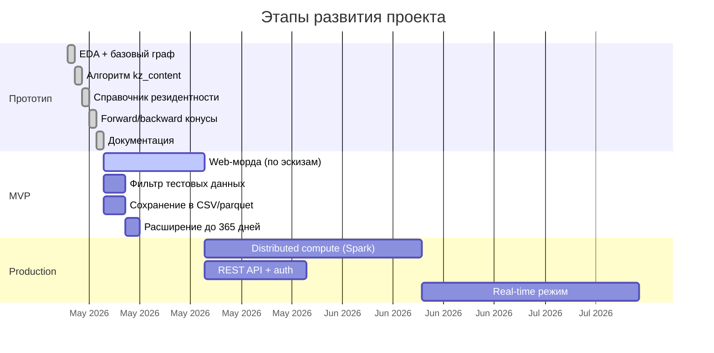

# Roadmap

Куда движется проект `digital-echo-core` после прототипа.

## Этап 1 — MVP (~3 недели)

### 1.1. Web-интерфейс

Эскизы готовит бизнес-аналитик. Ожидаемая функциональность:

- :material-magnify: Поиск по BIN или названию;
- :material-chart-line: Дашборд с агрегатами по экономике;
- :material-graph-outline: Визуализация графа поставщиков/покупателей
  в виде интерактивного дерева;
- :material-history: История запросов / закладки;
- :material-file-export: Экспорт отчётов.

Стек подбирается под корпоративные стандарты; отдельно прорабатывается
отображение долгого пересчёта в интерфейсе.

### 1.2. Фильтр тестовых данных

Подключить:

- Чёрный список BIN'ов (внешний YAML-файл);
- Опциональный фильтр по статусу в справочнике (например, исключить «закрытых» налогоплательщиков);
- Шаблоны имён (например, исключить всё, что начинается с «Company »
  или содержит «Тест»).

Реализация — отдельный модуль фильтров в конвейере загрузки графа.

### 1.3. Сохранение результатов

Добавить флаги:

- `--output csv` — сохранить рёбра + узлы с kz в CSV;
- `--output parquet` — то же в parquet (для аналитиков);
- `--output json` — JSON-снимок для следующего шага (web).

Имя файла включает дату, период, hash параметров — чтобы можно было
отследить, на каких данных получен отчёт.

### 1.4. Расширение периода

Поддержать `--from YYYY-MM-DD --to YYYY-MM-DD` для произвольных окон
(не только «последние N дней»).

## Этап 2 — Production-ready (~2 месяца)

### 2.1. Программный интерфейс и аутентификация

Вынести стабильный контракт для интеграций: запуск пересчёта, статус задач,
выдача профилей компаний и агрегатов. Аутентификация — в т.ч. через
корпоративный провайдер (SSO).

### 2.2. Distributed compute

При росте графа до 1M+ узлов:

- Граф — в Apache Spark GraphFrames или GraphX;
- Fixed-point — через distributed pregel-like API;
- Хранение между прогонами — parquet на HDFS / S3.

Альтернатива — переход на `graph-tool` с распараллеливанием через
multiprocessing на одной мощной машине.

### 2.3. Real-time режим

Сейчас 80 секунд на пересчёт всего. Если бизнес попросит «тут же увидеть,
как изменился kz после новой сделки» — нужен инкрементальный режим:

1. Хранить состояние kz в Redis / LMDB;
2. На приход нового документа — обновить веса рёбер;
3. Запустить локальную fixed-point итерацию только в окрестности
   изменения (BFS на 3–5 шагов).

Это **существенно сложнее**, не делаем без явного запроса.

## Этап 3 — Аналитические возможности (long-term)

### 3.1. Декомпозиция по группам товаров

Если в данных появятся **коды ТРУ** (товары, работы, услуги),
можно считать индекс **отдельно для каждой группы**:

- Индекс КС в продуктах питания;
- Индекс КС в IT-услугах;
- Индекс КС в металлопрокате;
- ...

Это потребует расширения схемы графа (multi-edge с category labels).

### 3.2. Динамика во времени

Сейчас один прогон = срез на период. Расширение:

- Считать индекс на скользящем окне (rolling 30/60/90 days);
- Хранить временные ряды для каждой компании;
- Графики тренда индекса в web-морде.

### 3.3. Сравнение «ожидаемое vs наблюдаемое»

Если у компании заявлено КС в 80%, а наш индекс показывает 40% —
это **сильный сигнал** для аудиторов. Нужно подключить:

- Источник заявленных индексов (от регулятора);
- Алгоритм cross-check'а;
- Алерты при крупных расхождениях.

### 3.4. Поиск аномалий

Машинное обучение поверх графа:

- Детекция «фиктивных циклов» (компании, продающие друг другу
  по схожим суммам с целью маскировки происхождения товара);
- Детекция аномально быстрого роста посредников;
- Детекция «бухгалтерского туризма» (одни и те же физлица в подписях
  у нескольких компаний).

### 3.5. Открытый API для исследователей

При наличии политического согласия — публичный read-only API с
агрегатами по отраслям/регионам, без раскрытия конкретных компаний.

## Технический долг (зачёркнуть до production)

- [ ] Покрытие тестами — нет ни одного `pytest` (был прототип);
- [ ] Расширить типизацию и покрытие тестами ядра расчёта;
- [ ] Логирование вместо `print()`;
- [ ] CI/CD — на момент прототипа `.github/workflows/` пуст;
- [ ] Schema validation для `.env` через `pydantic-settings`;
- [ ] Health checks для подключений к источникам данных;
- [ ] Retry с exponential backoff на сетевые ошибки;
- [ ] Profiling — где реально уходит время в `compute_kz_content`.

## Открытые вопросы

| Вопрос | Кому задать |
|---|---|
| Можно ли получить production-доступ к ЭСФ для пилота? | Архитектор ИС ЭСФ |
| Есть ли в реестре дополнительные атрибуты компаний (отрасль, регион)? | VoltDB DBA |
| Какой формат отчётов нужен регулятору для прийома? | Бизнес-владелец |
| Когда планируется унификация формата БИН/ИИН в учётном хранилище ЭСФ? | DBA источника ЭСФ |
| Каковы ожидания по производительности на годовом срезе? | Архитектор |
