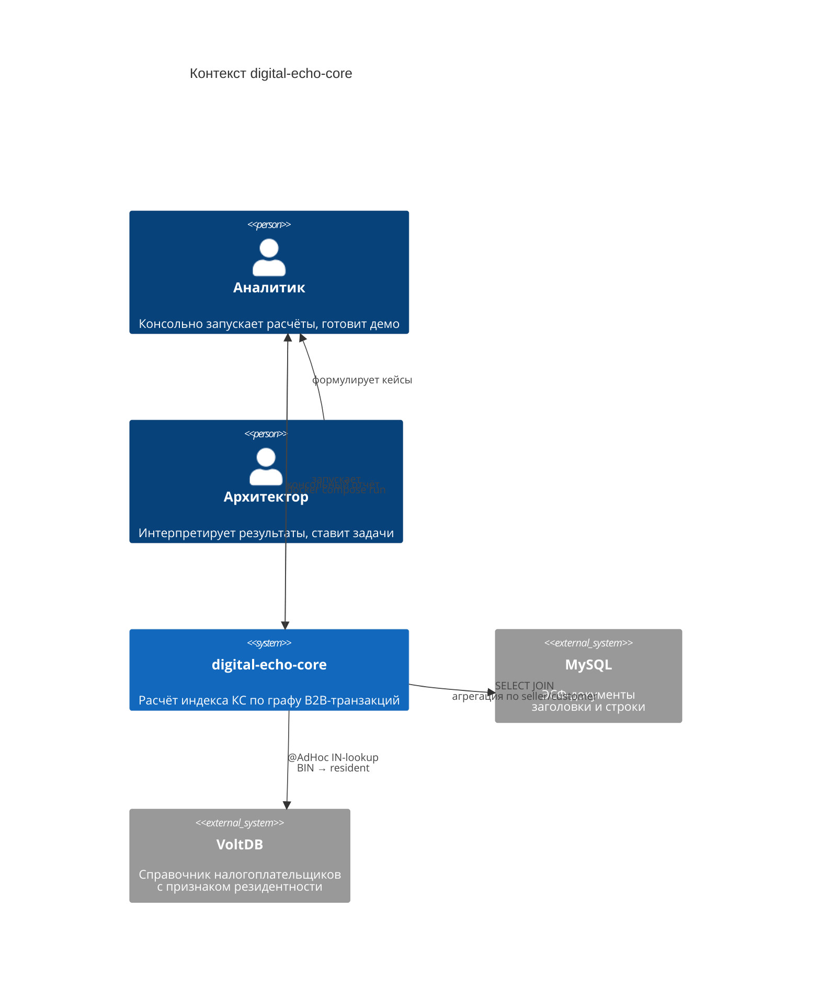
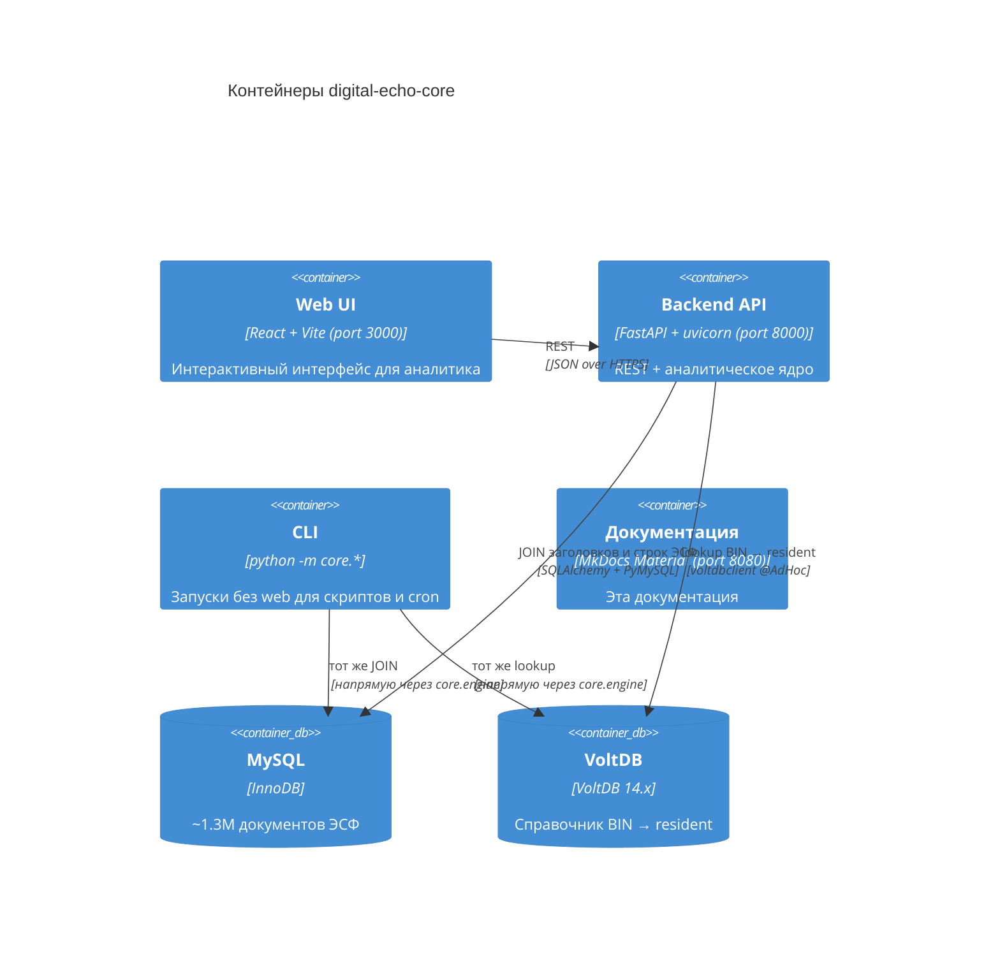
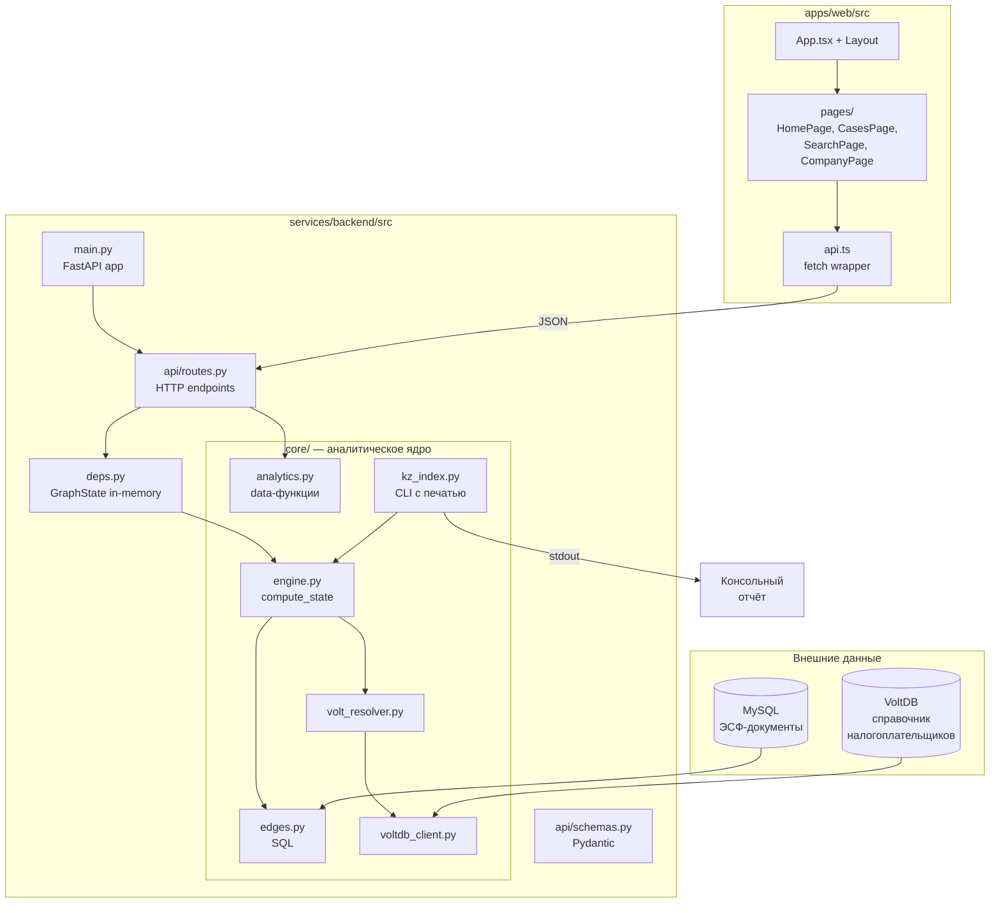
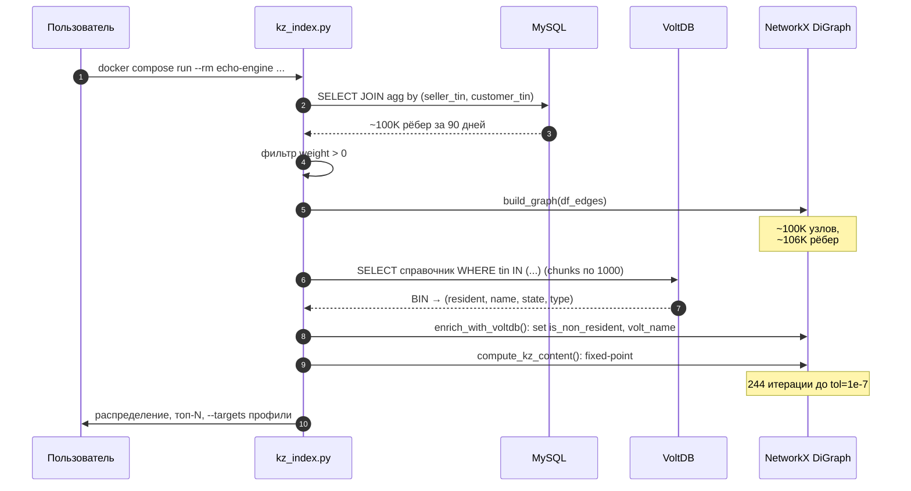

# Архитектура

## Контекст

Движок `digital-echo-core` — это batch-обработчик: за один запуск он
вытягивает срез транзакций за период, обогащает его справочной информацией
и считает индекс КС для всех узлов графа.

Все взаимодействия с внешними системами идут через два протокола:

- **MySQL** — единственный источник транзакций (ЭСФ-документы);
- **VoltDB** — единственный источник справочной информации о налогоплательщиках.



## Контейнеры



## Внутренняя структура



## Поток данных одного прогона



## Стейтлес и идемпотентность

Движок не хранит состояние между запусками. Каждый прогон **полностью
пересчитывает** граф и индекс. Это даёт два важных свойства:

- **Идемпотентность**: одинаковые входные параметры → одинаковый результат.
- **Отсутствие миграций**: не нужно дампить промежуточные таблицы,
  не нужно следить за версиями схемы.

Цена — 80 секунд на полный прогон при 100K узлов / 90-дневный период.
Это **сознательный размен**: на демо-фазе скорость не важна, а
повторяемость — критична.

См. [ADR-001](decisions/001-graph-engine.md) о выборе in-memory подхода.

## Конфигурация и секреты

Все секреты живут в `.env` (не в git). Шаблон — `.env.example`:

```ini
# MySQL (источник транзакций)
MYSQL_HOST=<MYSQL_HOST>
MYSQL_PORT=<MYSQL_PORT>
MYSQL_USER=<MYSQL_USER>
MYSQL_PASSWORD=<MYSQL_PASSWORD>
MYSQL_DATABASE=<MYSQL_DATABASE>

# VoltDB (справочник резидентности)
VOLTDB_HOSTS=<VOLTDB_HOSTS>
VOLTDB_PORT=<VOLTDB_PORT>
VOLTDB_USER=<VOLTDB_USER>
VOLTDB_PASSWORD=<VOLTDB_PASSWORD>
```

`build_connection_url()` в `main.py` собирает MySQL-URL с экранированием
спецсимволов (`quote_plus` — на случай `$`, `@`, `-` в пароле).

`VoltDBClient.from_env()` читает `VOLTDB_*` и поддерживает несколько хостов
через запятую (например, `VOLTDB_HOSTS=host1,host2`).

## Что мы намеренно НЕ строим (пока)

- :material-close: **БД-кэш промежуточных результатов.** Прогон должен быть
  чистым, без серых зон «а это в кэше или свежее».
- :material-close: **Очередь и оркестратор.** Один скрипт — одна команда.
  Когда понадобится планировщик — обернём в Airflow/Prefect.
- :material-close: **Отдельный API-слой.** Web-морда (по эскизам аналитика)
  будет читать те же модули напрямую — без REST-прослойки.
- :material-close: **Распределённый компьют.** 100K-200K узлов спокойно
  держатся в памяти. Если понадобится 10M+ — переедем на
  graph-tool/igraph или на Spark GraphFrames.

См. [Roadmap](../../docs/roadmap.md) о том, куда планируем двигаться.
