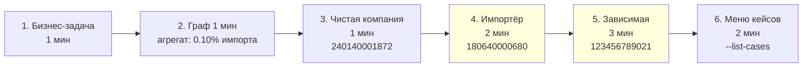

# Демо-сценарии

Эта страница — практическое руководство к показу проекта на демо.
Здесь собраны 4 архетипических BIN'а, рекомендованный порядок показа и
нюансы каждого кейса.

!!! note "Аудитория"
    Эти сценарии настроены под **бизнес-аудиторию** (руководство,
    архитекторы, аналитики). Для тех-демо см. отдельные ссылки на
    [Алгоритм](../algorithm/index.md) и [Архитектуру](../architecture.md).

## Структура демо (~10 минут)



## Подготовка перед демо

### За 5 минут до старта

1. Убедиться, что VPN/доступ к корпоративным БД работает.
2. Прогреть Docker:

    ```bash
    docker compose run --rm echo-engine python kz_index.py --days 90 --list-cases > /dev/null 2>&1
    ```

    Это нужно чтобы первый «настоящий» прогон не споткнулся об ошибку
    подключения и был быстрым (часть данных кэшируется в DataFrame на
    стороне MySQL и в TaxpayerResolver).

3. Запустить документацию параллельно:

    ```bash
    docker compose up -d docs
    open http://localhost:8000
    ```

### Команда для демо

Один универсальный запрос с тремя архетипами:

```bash
docker compose run --rm echo-engine python kz_index.py --days 90 \
  --targets 240140001872,180640000680,123456789021
```

Один прогон ~80 секунд, потом три полных профиля печатаются мгновенно.

## Сценарий 1: «Чистая крупная компания»

**BIN: `240140001872`** (Company 45862)

| Метрика | Значение |
|---|---|
| Продажи | 11.85 млрд ₸ |
| `kz` | 1.00 |
| Роль | посредник / производитель |

### Что говорить

> «Это здоровое звено экономики. Компания продала за 90 дней почти 12
> миллиардов тенге, и весь её товар имеет 100% казахстанского содержания.
> Все её поставщики — резиденты, у всех тоже kz=1.00. Алгоритм не
> штрафует за крупный размер — он смотрит только на природу контрагентов».

### Что показать

- Backward-конус: 3 поставщика, все kz=1.0;
- Forward-конус: 3 покупателя, все kz=1.0;
- На слайде/в отчёте подсветить «Импортная составляющая в продажах: 5 ₸».

## Сценарий 2: «Импортёр»

**BIN: `180640000680`** (Company 85645214)

| Метрика | Значение |
|---|---|
| Тип | нерезидент |
| Продажи | 14.48 млн ₸ |
| `kz` | 0.00 |
| Роль | нерезидент-импортёр |
| Прямых покупателей в РК | 91 |

### Что говорить

> «Это иностранный поставщик. Он продал в Казахстан товара на 14 миллионов
> и его 91 покупатель — это, по сути, точки входа импорта в нашу
> экономику. Forward-конус показывает, как импорт распространяется».

### Что показать

- Backward-конус: пустой (нерезидент, нет поставщиков в графе);
- Forward-конус: 91 покупатель, **топ-10 имеют 100% долю** — то есть
  для них этот нерезидент = единственный поставщик в этом периоде;
- В слое 1 — 91 компания, **из них все 91 — конечные потребители**:
  товар не идёт дальше по цепочке.

### Ключевая инсайт-фраза

> «Все 91 покупателей — конечные потребители, поэтому импорт оседает в
> рознице/малом бизнесе. Это типичная картина для нашего тестового
> периода и для большинства потребительских товаров».

## Сценарий 3: «Зависимая через цикл»

**BIN: `123456789021`** (ТОО «Асем-2»)

| Метрика | Значение |
|---|---|
| Тип | резидент |
| Продажи | 12.00 млн ₸ |
| `kz` | 0.38 (37.68%) |
| Роль | посредник |
| Прямых поставщиков | 4 |
| Прямых покупателей | 8 |

### Что говорить

> «Это самый интересный пример. Формально — казахстанская компания,
> резидент. Но индекс — всего 38%. Почему? Алгоритм нашёл в её цепочке
> поставщиков нерезидента (ИП Тестовый, через которого пришёл всего
> 7.9% оборота), и заметил, что вся группа из трёх компаний крутится в
> цикле — продают друг другу. Из-за этого замкнутого цикла импорт
> «заразил» всю группу одинаково».

### Что показать

- Backward-конус:
    - 4 прямых поставщика, **один нерезидент** (ИП Тестовый, 7.9%);
    - На слое 1: 4 компании, avg kz = 0.438, нерезидентов: 1.
- Forward-конус:
    - 8 покупателей, видно как 6 из них имеют kz=0.38 (часть цикла!);
    - 2 покупателей с kz=1.00 — это куда товар уходит «наружу» цикла.

### Ключевая инсайт-фраза

> «Алгоритм видит то, что ручной аудит не видит: 7.9% прямого импорта
> через цикл превратились в 62% импорта на выходе компании. Это эффект
> «эха» в графе».

## Сценарий 4: «Меню кейсов»

После трёх живых примеров — меню `--list-cases`. Это шанс ответить
на вопросы аудитории и попросить BIN из зала.

```bash
docker compose run --rm echo-engine python kz_index.py --days 90 --list-cases
```

### Что показать

Все 4 группы:

1. **Импортёры** (нерезиденты с продажами) — топ-5;
2. **Зависимые** (резиденты с kz < 0.7 и продажами > 10 млн);
3. **Чистые крупные** (резиденты с kz ≈ 1.0 и продажами > 100 млн);
4. **В нетривиальных циклах** (SCC > 1).

### Если из зала просят свежий BIN

```bash
docker compose run --rm echo-engine python kz_index.py --days 90 \
  --targets <свежий_BIN>
```

80 секунд ожидания. Можно использовать паузу для ответов на другие вопросы.

## Что ответить на типовые вопросы

### «А почему всего 0.10% импорта в обороте?»

> «Это тестовая среда. На production-данных мы ожидаем сильно более
> высокую долю — но точное число можно будет назвать только после
> прогона на свежей выгрузке».

### «Можете ли вы пересчитать с другим периодом?»

> «Да: `--days 365` — ожидаемо ~5 минут на полный год. Тесть запас по
> производительности. Если нужно поменять окно — это один параметр».

### «А если компания не нашлась в VoltDB?»

> «Считаем её резидентом «оптимистично». Это сознательное допущение —
> мы не штрафуем за пробелы в справочнике. Подробнее — в
> [ограничениях](../../docs/limitations.md)».

### «Как обрабатываются циклы?»

> «Через fixed-point итерации, как в PageRank. Для всех узлов одного
> цикла индекс получается одинаковым — это математически корректно.
> [Подробнее в алгоритме](../../docs/algorithm/kz-content.md#cycles-example)».

### «Можно ли добавить веб-интерфейс?»

> «Да, это следующий шаг. Эскизы уже готовы у бизнес-аналитика.
> [Roadmap](../../docs/roadmap.md)».

## Запасные сценарии (если основные не сработали)

| Кейс | BIN | Когда использовать |
|---|---|---|
| Резидент-источник | `940140000385` | Если хотим показать «чистую» точку входа без импорта |
| Большой посредник | `100641009655` | 488 млн ₸, 5292 уникальных продаж |
| ИП Тестовый | `920806450284` | Если кто-то спросит «а что с тестовыми данными» |

## После демо

Чтобы сохранить отчёт прогона:

```bash
docker compose run --rm echo-engine python kz_index.py --days 90 \
  --targets 240140001872,180640000680,123456789021 \
  > demo_report_$(date +%Y%m%d_%H%M).txt 2>&1
```

Можно прикрепить к follow-up email.
